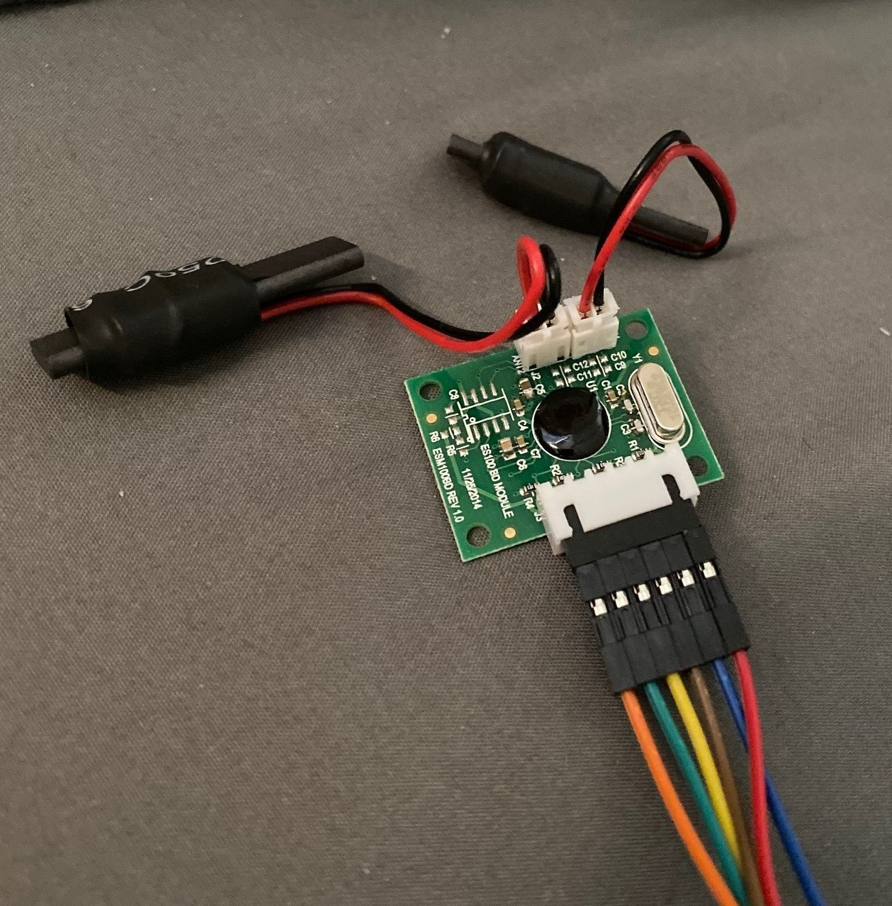
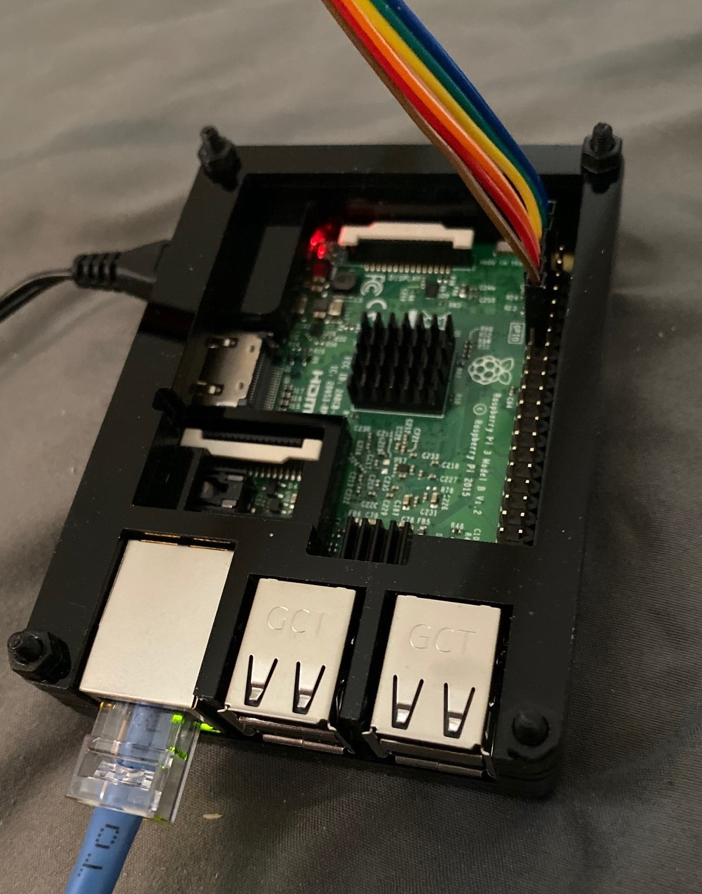
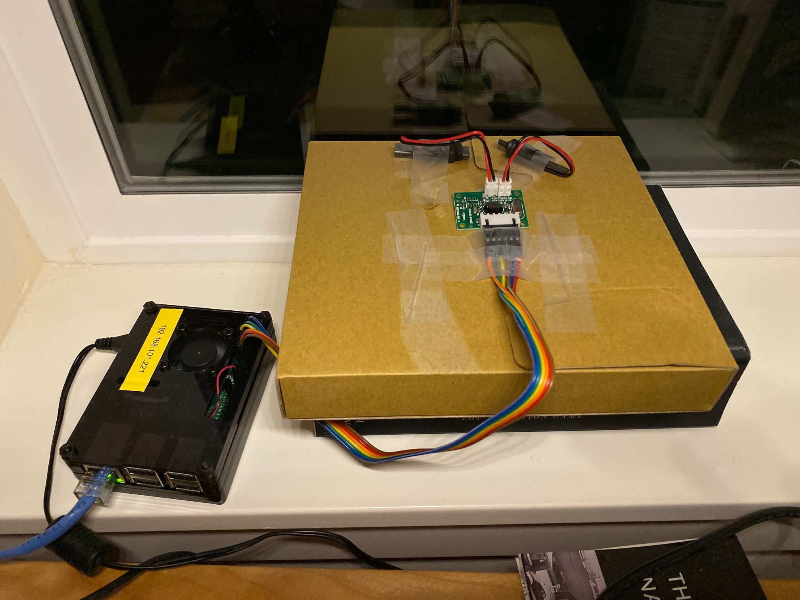
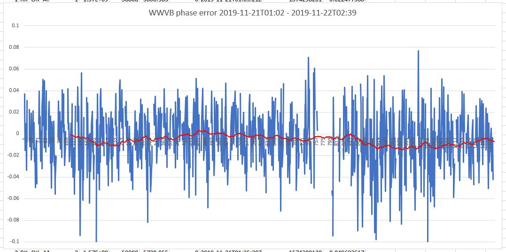

# es100-wwvb-refclock
Python test code and Shared memory NTP reference clock for Everset es100 WWVB receiver

## Description

This repository contains software to interface with Everset es100 WWVB receiver. This receiver is a dual-antenna software-defined radioclock which gets the timestamp code transmitted by NIST's WWVB 60 kHz radio station in Fort Collins, Colorado.

The test code is written in Python for ease of use, developed and tested on Raspberry PI 3.

The code is intended to run forever by a daemon, and keeps receiving data from WWVB.
If the code is only run in intermittent mode, do not allow tracking mode when instantiating the class es100_wwvb.

Theory of operation:
It starts receiving from ANTENNA 1 by default, then it keeps using the same antenna for as long as RX is successful. Upon RX timeout or RX error it switches to the other antenna. The receive timestamp is taken with PPS api when GPIO_IRQ goes low, thus its accuracy does not depend on the I2C bus's baud rate.
There are two RX modes, "normal mode" or "full mode" where a full UTC timestamp is received, and "tracking mode, where only the mark of a second is received, similar to a PPS mode. Full mode is required at the beginning regardless. If tracking mode is enabled, a successful full rx allows switching to tracking mode provided that the clock offset is within 250 milliseconds. tracking mode only works correctly if the local clock is very close to the actual time. if an rx timestamp in tracking mode exceeds an error of 250 milliseconds, we assume that the local clock has drifted too much, in which case we revert to full RX mode to make sure the time is correct.



## Using NTP SHM reflock

* Compile included update_shm_one_shot tool using "make"
* Add this configuration to your /etc/ntp.conf
```
#
# WWVB SHM unit 13 refclock  - do you feel lucky, punk?
#
server 127.127.28.13 mode 0 prefer
fudge 127.127.28.13 refid WWVB
```
* Restart ntp
* Start refclock code in the background using "es100_wwvb_clockref.sh" script. Make sure you start the test code in the same directory where the tool resides (ugly, will fix)
* After a few successful RX updates, the refclock should show as reachable. Example:
```
     remote           refid      st t when poll reach   delay   offset  jitter
==============================================================================
*SHM(13)         .WWVB.           0 l  329   64  240    0.000   -4.031  25.183
+ticktock.pengui .GPS.            1 u   39   64  377    0.361  -18.748   2.061
+pendulum.pengui .GPS.            1 u   25   64  377    0.411  -18.490   2.184
+clepsydra.pengu .GSYM.           1 u   10   64  377    0.374  -16.582   3.385
```

## TODO

* The current code only considers the current time, which can be very wrong at the beginning when the clock is not set. this works okay so long as NTP is initially set correctly.
* Force full RX mode every few hours, or at least during night time.
* Use monotonic clock to avoid current time errors.
* Using /sys/devices to read PPS timestamps is non-portable and needs to be fixed. Python ctypes is the magic word.
* Cleanup code.

## CHANGELOG

* See CHANGELOG file

## Acknowledgments

* Many thanks to members of time-nuts mailing list. Particular thanks to Hal Murray.
* Many thanks to my wife and daugthers, who somehow think my timekeeping hobby is weird, but still put up with me.

## Links

* EVERSET
	* Datasheet http://everset-tech.com/wp-content/uploads/2014/11/ES100DataSheetver0p97.pdf
	* Related Arduino project which contains information not specified in the datasheet https://sites.google.com/site/wwvbreceiverwitharduino/
	* North America Distributor https://www.universal-solder.ca/product/everset-es100-cob-wwvb-60khz-bpsk-receiver-kit-with-2-antennas/
	* Amazon https://www.amazon.com/gp/product/B07PDW1QPX/ref=ppx_yo_dt_b_asin_title_o09_s00?ie=UTF8&psc=1
	* https://time-nuts.febo.narkive.com/gETMuwcR/new-wwvb-bpsk-dev-board
	* https://www.kb6nu.com/building-a-wwvb-receiver-episode-2/
	* https://www.tinaja.com/third/wwvbuser01.pdf
* WWVB general information
	* WWVB Wikipedia https://en.wikipedia.org/wiki/WWVB
	* NIST's WWVB Page https://www.nist.gov/pml/time-and-frequency-division/radio-stations/wwvb
	* https://tf.nist.gov/general/pdf/2429.pdf
	* https://www.febo.com/time-freq/wwvb/index.html
	* https://tf.nist.gov/general/pdf/1969.pdf
	* https://www.nist.gov/system/files/documents/2017/05/09/NIST-Enhanced-WWVB-Broadcast-Format-1_01-2013-11-06.pdf
* Tools:
	* http://www.wriley.com/
	* https://ieee-uffc.org/frequency-control/frequency-control-software/stable32/
* Links of interest and related projects
	* https://sites.google.com/site/wwvbreceiverwitharduino/
	* https://ieeexplore.ieee.org/document/1701081
	* https://www.ion.org/publications/abstract.cfm?articleID=15622
	* http://www.leapsecond.com/pages/sony-wwvb/
	* https://www.raspberrypi.org/forums/viewtopic.php?t=20968
	* https://www.satsignal.eu/ntp/Raspberry-Pi-quickstart.html
	* http://www.buzzard.me.uk/jonathan/radioclock.html
	* http://www.ko4bb.com/Timing/
	* http://leapsecond.com/time-nuts.htm
	* http://www.leapsecond.com/hsn2006/ch2.pdf
	* https://github.com/hans-mayer/ntpgraph
	* http://support.ntp.org/bin/view/Support/MonitoringAndControllingNTP#scripts_stats_tools
	* http://www.ntp.org/ntpfaq/NTP-s-trouble.htm

## Hardware Description and Setup

The hardware kit comes with a small PCB with the software-defined radio and two small ferrite antennas. Everset claims significantly improved RX ability over a single antenna system -- there is quite a bit of debate about this on time-nuts mailing list. Future statistics should be able to tell if this claim is true.
* White Paper on the WWVB receiver: https://s2.smu.edu/~yliang/publications/A%20Multi-Mode%20Software-Defined%20CMOS%20BPSK%20Receiver%20SoC%20for%20WWVB.PDF
* Any suitable I2C bus and 3.3v GPIO pins can be used of course. In my case the setup for Raspberry PI3 is as follows:
```
PI3 PHYS PIN    BCM PIN     PI3 PIN FUNCTION                 WIRE COLOR
============    =======     ================                 ==========
1                           VCC (3.3V)                       BLUE
3               2           SDA (I2C DATA)                   GREEN
5               3           SCL (I2C CLOCK)                  YELLOW
7               4           GPIO.7 (3.3V DEV_ENABLE)         ORANGE
9                           GND                              RED
11              17          GPIO.0 (3.3V DEV_IRQ)            BROWN
```
* The corresponding pinout on the ES100 WWVB hardware is as follows:
```
ES100 WWVB PIN          WIRE COLOR
==============          ==========
1 = GND                 RED
2 = VDD                 BLUE
3 = IRQ                 BROWN
4 = SCK                 YELLOW
5 = SDA                 GREEN
6 = EN                  ORANGE
```

* The wire colors are of course completely arbitrary. I didn't want to break apart the ribbon wire, so I ended up with GND being red. Oh well.
* Before starting the test program, make sure that the I2C bus is enabled and running. I have set a 9600 baud rate for the I2C clock, although quite likely higher baud rates can be used.
* Everset Antenna Considerations: http://everset-tech.com/wp-content/uploads/2014/11/AN-005_Everset_Antenna_Considerations_rev_1p1.pdf
In my current test installation I placed the two antennas at 45 degrees of each other, with the median orientation being loosely pointed to Fort Collins, Colorado. The receiver is located neart Seattle, Washington, at a Great Circle distance of 1577 Km, (980 Mi, 851 Nmi).


## System Configuration
* Enable I2C
* Enable SMBUS
* Enable PPS (PPS should already configured by default, so all you should have to do is make sure that gpio-pps module is loaded at boot time)
* Setup PPS in /boot/config.txt - note that the pin numbering in /boot/config.txt follows the BCM numbering
```
dtoverlay=pps-gpio,gpiopin=17,capture_clear
```

## ES100 kinks

* None seen so far. ES100 appears to behave per Everset datasheet specs.

## Recent Results

* Results for the time interval 2019-11-21T01:02Z to 2019-1122T02:39Z, in a one minute cadence (except for errors)
* RX statistics indicate a successful RX rate of about 78%. All the failed RX are due to the fact that the WWVB station does not broadcast BPSK encoding during six minutes each half hour, from 10–16 and 40–46 minutes past each hour.
	* Total RX attempts       1220
	* Successful RX attempts   960
* Phase (aka offset) error statistics compared against a local GPS-disciplined stratum-1 clock
	* Average  -5.64 milliseconds
	* Median   -4.71 milliseconds
	* STDDEV   0.027
* Phase (aka offset) error plot, with 120 minutes moving average (RX errors are ignored here). Note this graph truncates two data samples which are around -200 milliseconds:


## Metrics

The sample code now also emits statistical information in a machine parseable format, useful to make Allan Plots and several other kinds of statistical inference. Two types of metrics are emitted:
* RX clockstats information **RX_WWVB_CLOCKSTATS**
```
pi@wwvb-raspberrypi:~/GITHUB/es100-wwvb-refclock $ grep RX_WWVB_CLOCKSTATS es100-wwvb-test.log 
```
* RX stats counter information **RX_WWVB_STAT_COUNTERS**
```
pi@wwvb-raspberrypi:~/GITHUB/es100-wwvb-refclock $ grep RX_WWVB_STAT_COUNTERS es100-wwvb-test.log 
```
Sample results for **RX_WWVB_CLOCKSTATS**:
```
RX_WWVB_CLOCKSTATS,v2,2,RX_OK_ANT2,2,1574299183.011537552,58808,4783.011537552,0,2019-11-21T01:19:43Z,1574299183.005239725,-0.006297827
RX_WWVB_CLOCKSTATS,v2,2,RX_OK_ANT2,2,1574299220.982684851,58808,4820.982684851,0,2019-11-21T01:20:21Z-T21-ROUNDUP,1574299221.005239725,0.022554874
RX_WWVB_CLOCKSTATS,v2,2,RX_OK_ANT2,2,1574299280.016940594,58808,4880.016940594,0,2019-11-21T01:21:20Z-T20-TRUNC,1574299280.005239725,-0.011700869
RX_WWVB_CLOCKSTATS,v2,2,RX_OK_ANT2,2,1574299341.008145332,58808,4941.008145332,0,2019-11-21T01:22:21Z-T21-TRUNC,1574299341.005239725,-0.002905607
RX_WWVB_CLOCKSTATS,v2,2,RX_OK_ANT2,2,1574299401.001959801,58808,5001.001959801,0,2019-11-21T01:23:21Z-T21-TRUNC,1574299401.005239725,0.003279924
```
* To produce a file with a format suitable for standard displaying with gnuplot, use tools/gnuplot-extract.sh:
```
pi@rasp-wwvb:~/GITHUB/es100-wwvb-refclock $ tools/gnuplot-extract.sh es100-wwvb-test.log
58808 3980.995705605 0.009534121
58808 4040.039047241 -0.033807516
58808 4100.974687099 0.030552626
58808 4160.012565851 -0.007326126
58808 4220.555790663 *
58808 4362.524651527 *
```


## Related WWVB Hardware

CANADUINO makes another WWVB receiver, based on the MAS6180C chip. This product is single antenna does not handle phase modulation, but provides for access to the digitalized raw bit stream. Something quite interesting. I have not played with this unit yet. Presumably the ability of reading the timing pulses of the AM modulation should allow software to both decode all the 60 data bits as well as get timing information from all timemark frames FRM, P1-P5 and P0.
* https://www.universal-solder.ca/product/canaduino-60khz-atomic-clock-receiver-module-wwvb-msf-jjy60/
* http://canaduino.ca/downloads/CANADUINO_Atomic_Clock_Receiver_Kit_SMD.pdf
* https://github.com/ahooper/WWVBClock
* https://sites.google.com/site/wwvbreceiverwitharduino/
